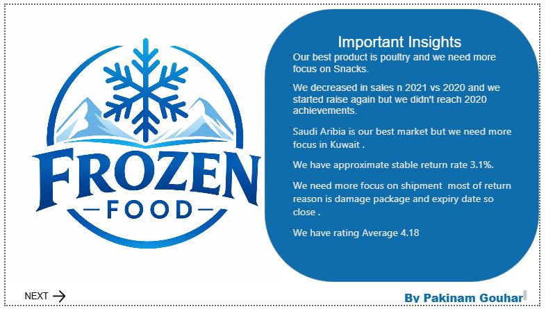
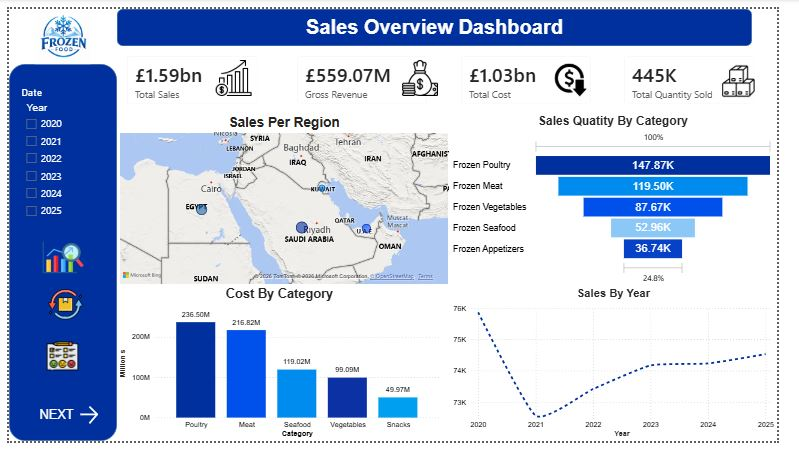
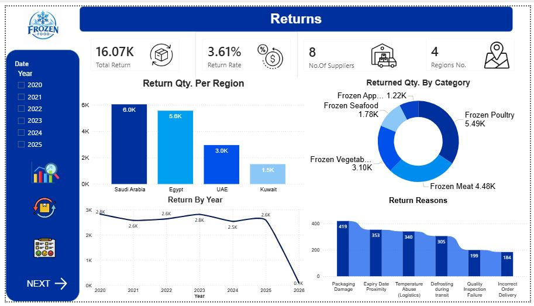
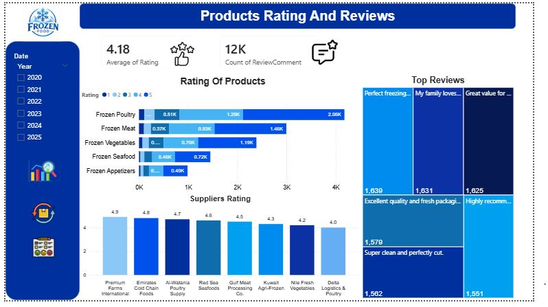

# 🧊 Frozen Food Sales Dashboard

## 📌 Project Overview

This project presents an interactive **Power BI dashboard** designed to analyze the sales performance of a frozen food business. It provides insights into revenue, profitability, customer behavior, product performance, and sales trends, helping decision-makers monitor business performance and identify growth opportunities.

---

## 🎯 Business Objectives

* Monitor overall sales performance.
* Analyze profit and profit margin.
* Identify top-performing products and categories.
* Track sales trends over time.
* Evaluate customer purchasing behavior.
* Support data-driven business decisions.

---

## 🛠️ Tools & Technologies

* **Power BI**
* **Power Query**
* **DAX**
* **Microsoft Excel**
* **Data Modeling**

---

## 📊 Key Performance Indicators (KPIs)

* 💰 Total Sales
* 📈 Total Profit
* 📦 Total Orders
* 👥 Total Customers
* 💵 Average Order Value
* 📊 Profit Margin (%)

---

## 📈 Dashboard Features

* Sales Trend Analysis
* Product Category Performance
* Top Selling Products
* Monthly Sales Comparison (MoM)
* Customer Analysis
* Regional Sales Performance
* Interactive Filters and Slicers
* Dynamic KPI Cards

---

## 📁 Dataset

The dataset contains transactional sales data for a frozen food company, including:

* Order Date
* Customer
* Product
* Category
* Quantity
* Unit Price
* Sales
* Cost
* Profit
* Region
* Sales Representative

---

## 📷 Dashboard Preview

### Overview

### Sales Analysis

### Product Performance

### Customer Analysis

---

## 📌 Key Insights

* Identified the highest revenue-generating products.
* Compared monthly sales performance using Month-over-Month analysis.
* Measured profitability across different product categories.
* Analyzed customer purchasing patterns.
* Highlighted regional performance differences.

---

## 🚀 Future Improvements

* Sales Forecasting
* Inventory Monitoring
* Customer Segmentation
* Supplier Performance Analysis
* Automated Data Refresh

---

## 👩‍💻 Author

**Pakinam Gouhar**

**Data Analyst**

### Skills

* Power BI
* SQL
* Excel
* Python
* DAX
* Power Query
* Data Visualization

**LinkedIn:**
[www.linkedin.com/in/pakinam-gouhar-a76011221](http://www.linkedin.com/in/pakinam-gouhar-a76011221)

